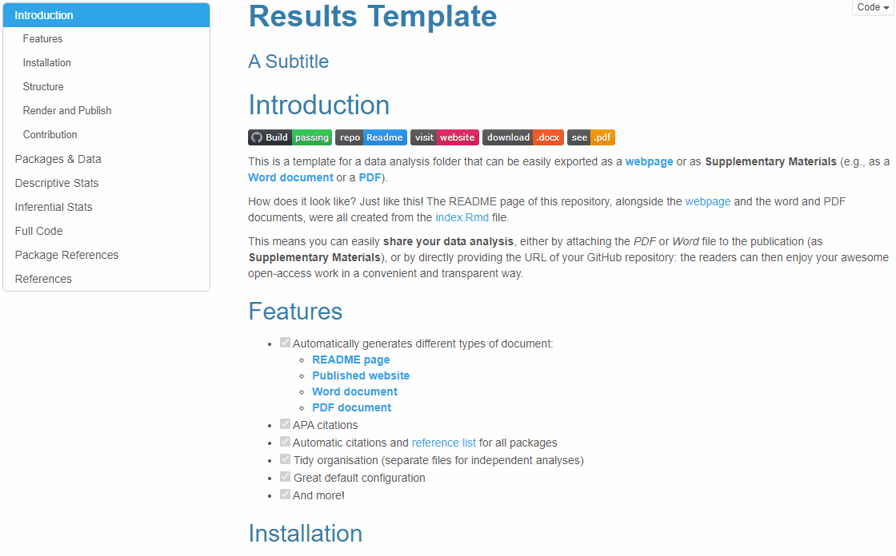
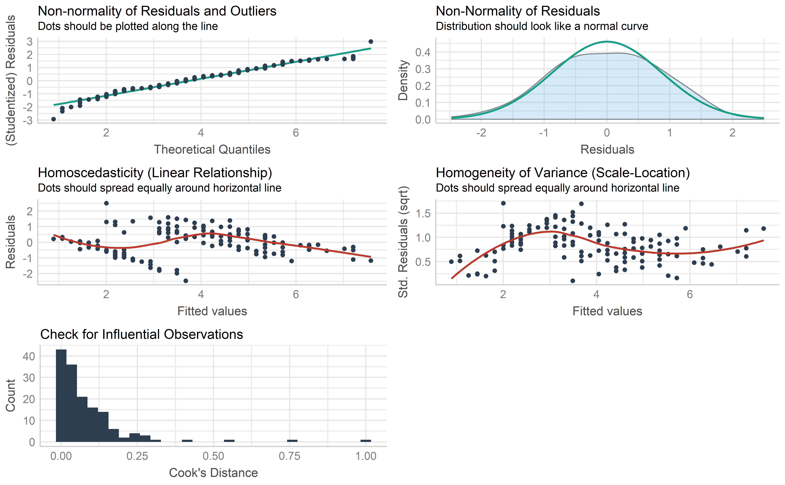

<!-- 
!!!! IMPORTANT: run `source("utils/render.R")` to publish instead of clicking on 'Knit'
-->

Introduction
============


[](https://github.com/RealityBending/TemplateResults)
[](https://realitybending.github.io/TemplateResults/)
[](https://github.com/RealityBending/TemplateResults/raw/main/word_and_pdf/SupplementaryMaterials.docx)
[](https://github.com/RealityBending/TemplateResults/blob/main/word_and_pdf/SupplementaryMaterials.pdf)

This is a template for a data analysis folder that can be easily
exported as a
[**webpage**](https://realitybending.github.io/TemplateResults/) or as
**Supplementary Materials** (e.g., as a [**Word
document**](https://github.com/RealityBending/TemplateResults/raw/main/word_and_pdf/SupplementaryMaterials.docx)
or a
[**PDF**](https://github.com/RealityBending/TemplateResults/blob/main/word_and_pdf/SupplementaryMaterials.pdf)).

How does it look like? Just like this! The README page of this
repository, alongside the
[webpage](https://realitybending.github.io/TemplateResults/) and the
word and PDF documents, were all created from the
[index.Rmd](https://github.com/RealityBending/TemplateResults/blob/main/index.Rmd)
file.

This means you can easily **share your data analysis**, either by
attaching the *PDF* or *Word* file to the publication (as
**Supplementary Materials**), or by directly providing the URL of your
GitHub repository: the readers can then enjoy your awesome open-access
work in a convenient and transparent way.

Features
--------

-   [x] Automatically generates different types of document:
    -   [**README
        page**](https://github.com/RealityBending/TemplateResults/blob/main/README.md)
    -   [**Published
        website**](https://realitybending.github.io/TemplateResults/)
    -   [**Word
        document**](https://github.com/RealityBending/TemplateResults/raw/main/word_and_pdf/SupplementaryMaterials.docx)
    -   [**PDF
        document**](https://github.com/RealityBending/TemplateResults/blob/main/word_and_pdf/SupplementaryMaterials.pdf)
-   [x] APA citations
-   [x] Automatic citations and [reference
    list](https://github.com/RealityBending/TemplateResults#package-references)
    for all packages
-   [x] Tidy organisation (separate files for independent analyses)
-   [x] Great default configuration
-   [x] And more!



Installation
------------

-   **What is this?**

This repository is a template to set up a reproducible, convenient and
shareable workflow for your data analysis. It consists of several
[*Rmarkdown*](https://rmarkdown.rstudio.com/lesson-1.html) files
(`.Rmd`), that allow you to have R code and text (markdown) in the same
document. Importantly, these files can be transformed into other
documents formats.

-   **How to use this template?**

Download it ([**click here to
download**](https://github.com/RealityBending/TemplateResults/archive/main.zip)),
unzip it and edit. Alternatively, you click on the [**Use this
template**](https://github.com/RealityBending/TemplateResults/generate)
button at the top of this screen to create a GitHub repository with all
the content copied (then you just need to clone the repo to your local
machine).

The main files you need to edit are the `.Rmd` files, that you can open
with some editor (e.g., [Rstudio](https://rstudio.com/)), and edit the
text and the R chunks of code.

-   **How to upload it to a website?**

If your repo is not already connected to GitHub, then create a new
repository and upload all the content (so that it looks like this repo).
Then, go to settings of the repo and enable **GitHub pages** (i.e., that
gives you a webpage from an html stored on GitHub), and select the
`docs/` folder as the location of the webpage. Indeed, rendering
(knitting) the files will generate an “index.html” file in the `/docs/`
folder, which is used as the website. You can see an example at
<https://realitybending.github.io/TemplateResults/>.

-   **To knit or not to knit**

In this repo, with have set up a [GitHub
action](https://github.com/RealityBending/TemplateResults/blob/main/.github/workflows/website.yml)
that generates all the output files everytime someone commit to the
repository. This means that the final documents here are always
“up-to-date” with the *Rmds* (as shown by the green badge). That said,
you can remove this GitHub action (just remove the
`.github/workflows/website.yml` file) if you prefer to generate the
documents manually only.

-   **But I don’t want do upload all my data**

In that case, you’ll need to 1) deactivate (i.e., remove the action
file) the automatic rendering by GitHub (as no data will be stored on
GitHub) and 2) mark the **data** folder as “to be ignored” (so that it
won’t be uploaded). This can be done by adding `/data/` to the
[**.gitignore**](https://github.com/RealityBending/TemplateResults/blob/main/.gitignore)
file (that you can open with a notepad). This means that you can still
store the data here locally, and generate the documents accordingly, but
the data folder will be ignored by git and never uploaded to GitHub.
This way, you can still have a cool website, an open-access script, but
the data is safe with you. The only down side is that you have to build
it manually (cannot use GitHub actions).

-   **How to add references?**

References have to be added in `bib` format in the
[*utils/bibliography.bib*](https://github.com/RealityBending/TemplateResults/blob/main/utils/bibliography.bib)
file, and further referenced in the text like this
`[@ludecke2019insight]` (Lüdecke, Waggoner, & Makowski, 2019).

-   **I don’t like the Word (.docx) theme**

The theme for the word document is defined in the
[\*\*Template\_Word.docx](https://github.com/RealityBending/TemplateResults/tree/main/utils)
file, in the `/utils/` folder. You need to edit the “styles” (not just
the content, but the style itself) to your preference.

-   **I have Python code**

Thanks to R’s possibilities when it comes to integration with Python,
it’s super easy to enable it in your pipeline. Just uncomment the
[Python installation
line](https://github.com/RealityBending/TemplateResults/blob/main/utils/config.R#L24)
in the `utils/config.R` file and you’re ready to go!

-   **It doesn’t work / I have questions / I have ideas**

Just [**open an
issue**](https://github.com/RealityBending/TemplateResults/issues) and
we’ll be happy to assist ☺

Structure
---------

Most files that you’ll need to create / edit will be written in
[**rmarkdown**](https://rmarkdown.rstudio.com/lesson-1.html), which
consists of a mix of markdown text and R chunks of code.

The main file is named
[**index.Rmd**](https://github.com/RealityBending/TemplateResults/blob/main/index.Rmd).
However, to avoid having overly long files, the different (and
independent) analyses parts are actually split in other documents. For
instance, in this template example, the descriptive statistics section
is in the
[**1\_descriptive.Rmd**](https://github.com/RealityBending/TemplateResults/blob/main/1_descriptive.Rmd)
file. As you can [see in the index
file](https://github.com/RealityBending/TemplateResults/blob/690f7947da0fc8ac85eaf6fb87fafeaa46fb3c50/index.Rmd#L89-L90),
this file is then integrated as a child document (i.e., it is merged).
This makes it very convenient to have a clear structure with
well-organized files, that are put together only when merged.

Render and Publish
------------------

Importantly, in order to render all the files, do not Knit this document
by pressing the ‘Knit’ button. If you do, it will create an output file
(for instance `index.html`) in the root folder, alongside `index.Rmd`.
This is **not what we want**, as we want to keep the output files tidy
in separate folders (for instance, the html version should be in the
`/docs/` folder, as this is where the website will look for).

There an R script,
[utils/render.R](https://github.com/RealityBending/TemplateResults/blob/main/utils/render.R),
that contains the lines to render everything in its correct location.
So, when you have the “index.Rmd” file opened (and your working
directory is at its root), simply run **`source("utils/render.R")`** in
the console (or the relevant lines in that file). This will run the
rendering file and create all the files.

Contribution
------------

Do not hesitate to improve this template by updating, documenting, or
expanding it!

Packages & Data
===============

Packages
--------

This document was prepared on 2021-05-24.

``` r
library(bayestestR)
library(parameters)
library(performance)
library(report)
library(see)
library(ggplot2)

summary(report::report(sessionInfo()))
```

The analysis was done using the R Statistical language (v4.0.5; R Core
Team, 2021) on macOS Catalina 10.15.7, using the packages ggplot2
(v3.3.3), stringr (v1.4.0), forcats (v0.5.1), tidyr (v1.1.3), readr
(v1.4.0), dplyr (v1.0.6), rmarkdown (v2.8), tibble (v3.1.2), purrr
(v0.3.4), parameters (v0.13.0.1), performance (v0.7.2), see (v0.6.3),
bayestestR (v0.9.0), report (v0.3.0.9000) and tidyverse (v1.3.1).

Data
----

``` r
df <- read.csv("data/data.csv")

cat(paste("The data consists of",
          report::report_participants(df,
                                      participants = "Participant",
                                      age = "Age")))
```

The data consists of 10 participants (Mean age = 29.9, SD = 0.5, range:
\[29.0, 30.91\])

Note that the chunks generating figures in the code below have some
arguments specified in their header, such as `fig.width` and
`fig.height`, which controls the figure size. These were filled with an
eponym argument defined in
[`utils/config.R`](https://github.com/RealityBending/TemplateResults/blob/main/utils/config.R#L26-L27).
We also set the resolution, i.e., `dpi`, to a low value so that the
resulting file is lighter. But **don’t forget to crank this value up**
(to 300-600) to get nice-looking results.

Descriptive Stats
=================

Notice the `{.tabset}` tag after the section name. This will show the
subsections as different tabs (in the [html
version](https://realitybending.github.io/TemplateResults/#Descriptive_Stats)
only, because the other formats are static).

Part 1
------

Here’s a cool plot:

``` r
ggplot(df, aes(x=V1, y=V2, color=Participant)) + 
  geom_point() +
  see::theme_modern()
```


Part 2
------

That’s another great plot:

``` r
plot(bayestestR::estimate_density(df[c("V1", "V2")])) +
  see::theme_blackboard()
```


Part 3
------

Did you ever hear the tragedy of Darth Plagueis The Wise? I thought not.
It’s not a story the Jedi would tell you. It’s a Sith legend. Darth
Plagueis was a Dark Lord of the Sith, so powerful and so wise he could
use the Force to influence the midichlorians to create life… He had such
a knowledge of the dark side that he could even keep the ones he cared
about from dying. The dark side of the Force is a pathway to many
abilities some consider to be unnatural. He became so powerful… the only
thing he was afraid of was losing his power, which eventually, of
course, he did. Unfortunately, he taught his apprentice everything he
knew, then his apprentice killed him in his sleep. Ironic. He could save
others from death, but not himself.

Inferential Stats
=================

Here is another analysis that is contained in a separate file. Let’s
check-out this linear regression model (note that, in the code chunk
parameters, I multiplied `figheight` by 2 to have a taller plot):

``` r
model <- lm(Petal.Length ~ Sepal.Length, data=iris)
performance::check_model(model)
```



Full Code
=========

The full script of executive code contained in this document is
reproduced here.

``` r
# Set up the environment (or use local alternative `source("utils/config.R")`)
source("https://raw.githubusercontent.com/RealityBending/TemplateResults/main/utils/config.R")  

fast <- FALSE  # Make this false to skip the chunks
# This chunk is a bit complex so don't worry about it: it's made to add badges to the HTML versions
# NOTE: You have to replace the links accordingly to have working "buttons" on the HTML versions
if (!knitr::is_latex_output() && knitr::is_html_output()) {
  cat("
      [](https://github.com/RealityBending/TemplateResults)
      [](https://realitybending.github.io/TemplateResults/)
      [](https://github.com/RealityBending/TemplateResults/raw/main/word_and_pdf/SupplementaryMaterials.docx)
      [](https://github.com/RealityBending/TemplateResults/blob/main/word_and_pdf/SupplementaryMaterials.pdf)")
}
# Let's include a demo GIF (this doesn't work in PDF documents)
if (!knitr::is_latex_output()) {
  
}
library(bayestestR)
library(parameters)
library(performance)
library(report)
library(see)
library(ggplot2)

summary(report::report(sessionInfo()))
df <- read.csv("data/data.csv")

cat(paste("The data consists of",
          report::report_participants(df,
                                      participants = "Participant",
                                      age = "Age")))
report::cite_packages(sessionInfo())
ggplot(df, aes(x=V1, y=V2, color=Participant)) + 
  geom_point() +
  see::theme_modern()
plot(bayestestR::estimate_density(df[c("V1", "V2")])) +
  see::theme_blackboard()
model <- lm(Petal.Length ~ Sepal.Length, data=iris)
performance::check_model(model)
```

Package References
==================

``` r
report::cite_packages(sessionInfo())
```

-   H. Wickham. ggplot2: Elegant Graphics for Data Analysis.
    Springer-Verlag New York, 2016.
-   Hadley Wickham (2019). stringr: Simple, Consistent Wrappers for
    Common String Operations. R package version 1.4.0.
    <a href="https://CRAN.R-project.org/package=stringr" class="uri">https://CRAN.R-project.org/package=stringr</a>
-   Hadley Wickham (2021). forcats: Tools for Working with Categorical
    Variables (Factors). R package version 0.5.1.
    <a href="https://CRAN.R-project.org/package=forcats" class="uri">https://CRAN.R-project.org/package=forcats</a>
-   Hadley Wickham (2021). tidyr: Tidy Messy Data. R package version
    1.1.3.
    <a href="https://CRAN.R-project.org/package=tidyr" class="uri">https://CRAN.R-project.org/package=tidyr</a>
-   Hadley Wickham and Jim Hester (2020). readr: Read Rectangular Text
    Data. R package version 1.4.0.
    <a href="https://CRAN.R-project.org/package=readr" class="uri">https://CRAN.R-project.org/package=readr</a>
-   Hadley Wickham, Romain François, Lionel Henry and Kirill Müller
    (2021). dplyr: A Grammar of Data Manipulation. R package version
    1.0.6.
    <a href="https://CRAN.R-project.org/package=dplyr" class="uri">https://CRAN.R-project.org/package=dplyr</a>
-   JJ Allaire and Yihui Xie and Jonathan McPherson and Javier Luraschi
    and Kevin Ushey and Aron Atkins and Hadley Wickham and Joe Cheng and
    Winston Chang and Richard Iannone (2021). rmarkdown: Dynamic
    Documents for R. R package version 2.8. URL
    <a href="https://rmarkdown.rstudio.com" class="uri">https://rmarkdown.rstudio.com</a>.
-   Kirill Müller and Hadley Wickham (2021). tibble: Simple Data Frames.
    R package version 3.1.2.
    <a href="https://CRAN.R-project.org/package=tibble" class="uri">https://CRAN.R-project.org/package=tibble</a>
-   Lionel Henry and Hadley Wickham (2020). purrr: Functional
    Programming Tools. R package version 0.3.4.
    <a href="https://CRAN.R-project.org/package=purrr" class="uri">https://CRAN.R-project.org/package=purrr</a>
-   Lüdecke D, Ben-Shachar M, Patil I, Makowski D (2020).
    “parameters:Extracting, Computing and Exploring the Parameters of
    StatisticalModels using R.” *Journal of Open Source Software*,
    *5*(53), 2445.
    <a href="doi:10.21105/joss.02445" class="uri">doi:10.21105/joss.02445</a>
    (URL:
    <a href="https://doi.org/10.21105/joss.02445" class="uri">https://doi.org/10.21105/joss.02445</a>).
-   Lüdecke et al., (2021). performance: An R Package for Assessment,
    Comparison and Testing of Statistical Models. Journal of Open Source
    Software, 6(60), 3139.
    <a href="https://doi.org/10.21105/joss.03139" class="uri">https://doi.org/10.21105/joss.03139</a>
-   Lüdecke, Ben-Shachar, Patil, Waggoner & Makowski (2020).
    Visualisation Toolbox for ‘easystats’ and Extra Geoms, Themes and
    Color Palettes for ‘ggplot2’. CRAN. Available from
    <a href="https://easystats.github.io/see/" class="uri">https://easystats.github.io/see/</a>
-   Makowski, D., Ben-Shachar, M., & Lüdecke, D. (2019). bayestestR:
    Describing Effects and their Uncertainty, Existence and Significance
    within the Bayesian Framework. Journal of Open Source Software,
    4(40), 1541.
    <a href="doi:10.21105/joss.01541" class="uri">doi:10.21105/joss.01541</a>
-   Makowski, D., Ben-Shachar, M.S., Patil, I. & Lüdecke, D. (2020).
    Automated Results Reporting as a Practical Tool to Improve
    Reproducibility and Methodological Best Practices Adoption. CRAN.
    Available from
    <a href="https://github.com/easystats/report" class="uri">https://github.com/easystats/report</a>.
    doi: .
-   R Core Team (2021). R: A language and environment for statistical
    computing. R Foundation for Statistical Computing, Vienna, Austria.
    URL
    <a href="https://www.R-project.org/" class="uri">https://www.R-project.org/</a>.
-   Wickham et al., (2019). Welcome to the tidyverse. Journal of Open
    Source Software, 4(43), 1686,
    <a href="https://doi.org/10.21105/joss.01686" class="uri">https://doi.org/10.21105/joss.01686</a>

References
==========

Lüdecke, D., Waggoner, P. D., & Makowski, D. (2019). Insight: A unified
interface to access information from model objects in r. *Journal of
Open Source Software*, *4*(38), 1412.
