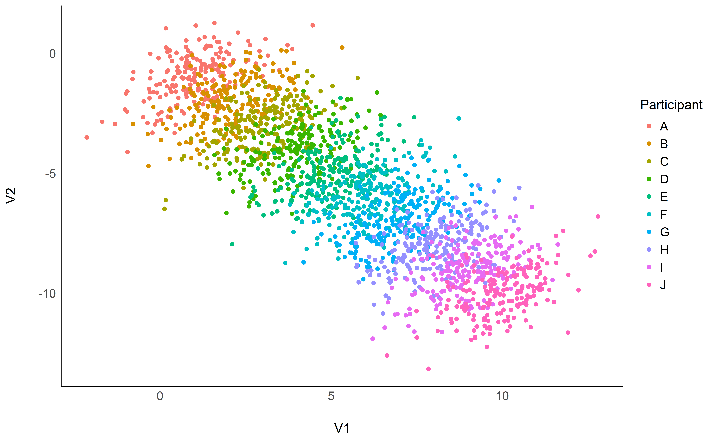

<!-- 
!!!! IMPORTANT !!!!

Do not Knit this document by pressing the 'Knit' button. 

Instead, run `source("utils/render.R")` in the console (or the relevant lines in that file). 

If not, it will create the output in the same folder, whereas we want to keep it tidy in separate folders. 
-->

# Introduction

This is a template for a data analysis folder that can be easily
exported as a
[**webpage**](https://realitybending.github.io/ResultsTemplate/) or as
**Supplementary Materials** (e.g., as a [word
document](https://realitybending.github.io/ResultsTemplate/word/)). The
README page of the repository, alongside the webpage and word document,
were all created from this single
[index.Rmd](https://github.com/RealityBending/ResultsTemplate/blob/main/index.Rmd)
that you can edit.

-   How to use this template?

Download it ([**click here to
download**](https://github.com/RealityBending/ResultsTemplate/archive/main.zip)),
unzip it and edit.

-   How to upload it to a website?

Upload the whole folder to GitHub, go to settings and enable GitHub
pages, and select the `docs/` folder as the location of the webpage.
Indeed, rendering (knitting) the files will generate an “index.html”
file in the `/docs/` folder, which is used as the website. You can see
an example at <https://realitybending.github.io/ResultsTemplate/>.

# Packages & Data

## Packages

``` r
library(easystats)

summary(report::report(sessionInfo()))
```

The analysis was done using the R Statistical language (v4.0.1; R Core
Team, 2020) on Windows 10 x64, using the packages effectsize (v0.4.3),
ggplot2 (v3.3.2), stringr (v1.4.0), forcats (v0.5.0), tidyr (v1.1.2),
readr (v1.3.1), dplyr (v1.0.3), rmarkdown (v2.5), tibble (v3.0.5), purrr
(v0.3.4), parameters (v0.11.0), insight (v0.12.0), see (v0.6.1),
performance (v0.6.1), modelbased (v0.5.1), easystats (v0.2.0),
correlation (v0.5.0), bayestestR (v0.8.2), report (v0.2.0), magrittr
(v2.0.1), tidyverse (v1.3.0) and knitr (v1.28).

## Data

``` r
df <- read.csv("data/data.csv")

cat(paste("The data consists of", 
          report::report_participants(df, 
                                      participants = "Participant", 
                                      age = "Age")))
```

The data consists of 10 participants (Mean age = 29.9, SD = 0.5, range:
\[29.0, 30.91\])

# Descriptive Stats

## Part 1

``` r
ggplot(df, aes(x=V1, y=V2, color=Participant)) + 
  geom_point() +
  see::theme_modern()
```



## Part 2

Let’s run some addition:

``` r
1+1
```

    > [1] 2

## Part 3

I don’t know what else to do.

# References

``` r
report::cite_packages(sessionInfo())
```

-   Ben-Shachar M, Lüdecke D, Makowski D (2020). effectsize: Estimation
    of Effect Size Indices and Standardized Parameters. Journal of Open
    Source Software, 5(56), 2815. doi: 10.21105/joss.02815
-   H. Wickham. ggplot2: Elegant Graphics for Data Analysis.
    Springer-Verlag New York, 2016.
-   Hadley Wickham (2019). stringr: Simple, Consistent Wrappers for
    Common String Operations. R package version 1.4.0.
    <https://CRAN.R-project.org/package=stringr>
-   Hadley Wickham (2020). forcats: Tools for Working with Categorical
    Variables (Factors). R package version 0.5.0.
    <https://CRAN.R-project.org/package=forcats>
-   Hadley Wickham (2020). tidyr: Tidy Messy Data. R package version
    1.1.2. <https://CRAN.R-project.org/package=tidyr>
-   Hadley Wickham, Jim Hester and Romain Francois (2018). readr: Read
    Rectangular Text Data. R package version 1.3.1.
    <https://CRAN.R-project.org/package=readr>
-   Hadley Wickham, Romain François, Lionel Henry and Kirill Müller
    (2021). dplyr: A Grammar of Data Manipulation. R package version
    1.0.3. <https://CRAN.R-project.org/package=dplyr>
-   JJ Allaire and Yihui Xie and Jonathan McPherson and Javier Luraschi
    and Kevin Ushey and Aron Atkins and Hadley Wickham and Joe Cheng and
    Winston Chang and Richard Iannone (2020). rmarkdown: Dynamic
    Documents for R. R package version 2.5. URL
    <https://rmarkdown.rstudio.com>.
-   Kirill Müller and Hadley Wickham (2021). tibble: Simple Data Frames.
    R package version 3.0.5. <https://CRAN.R-project.org/package=tibble>
-   Lionel Henry and Hadley Wickham (2020). purrr: Functional
    Programming Tools. R package version 0.3.4.
    <https://CRAN.R-project.org/package=purrr>
-   Lüdecke D, Ben-Shachar M, Patil I, Makowski D (2020). “parameters:
    Extracting, Computing and Exploring theParameters of Statistical
    Models using R.” *Journal of Open Source Software*, *5*(53), 2445.
    <doi:10.21105/joss.02445> (URL:
    <https://doi.org/10.21105/joss.02445>).
-   Lüdecke D, Waggoner P, Makowski D (2019). “insight: A Unified
    Interface to Access Information from ModelObjects in R.” *Journal of
    Open Source Software*, *4*(38), 1412. doi: 10.21105/joss.01412
    (URL:<https://doi.org/10.21105/joss.01412>).
-   Lüdecke, Ben-Shachar, Waggoner & Makowski (2020). Visualisation
    Toolbox for ‘easystats’ and Extra Geoms, Themes and Color Palettes
    for ‘ggplot2.’ CRAN. Available from
    <https://easystats.github.io/see/>
-   Lüdecke, Makowski, Waggoner & Patil (2020). Assessment of Regression
    Models Performance. CRAN. Available from
    <https://easystats.github.io/performance/>
-   Makowski, D., Ben-Shachar, M. S. & Lüdecke, D. (2020). *Estimation
    of Model-Based Predictions, Contrasts and Means*. CRAN.
-   Makowski, D., Ben-Shachar, M. S. & Lüdecke, D. (2020). *Estimation
    of Model-Based Predictions, Contrasts and Means*. GitHub.
-   Makowski, D., Ben-Shachar, M. S., Patil, I., & Lüdecke, D. (2019).
    Methods and Algorithms for Correlation Analysis in R. Journal of
    Open Source Software, 5(51), 2306. 10.21105/joss.02306
-   Makowski, D., Ben-Shachar, M., & Lüdecke, D. (2019). bayestestR:
    Describing Effects and their Uncertainty, Existence and Significance
    within the Bayesian Framework. Journal of Open Source Software,
    4(40), 1541. <doi:10.21105/joss.01541>
-   Makowski, D., Lüdecke, D., & Ben-Shachar, M.S. (2020). Automated
    reporting as a practical tool to improve reproducibility and
    methodological best practices adoption. CRAN. Available from
    <https://github.com/easystats/report>. doi: .
-   R Core Team (2020). R: A language and environment for statistical
    computing. R Foundation for Statistical Computing, Vienna, Austria.
    URL <https://www.R-project.org/>.
-   Stefan Milton Bache and Hadley Wickham (2020). magrittr: A
    Forward-Pipe Operator for R. R package version 2.0.1.
    <https://CRAN.R-project.org/package=magrittr>
-   Wickham et al., (2019). Welcome to the tidyverse. Journal of Open
    Source Software, 4(43), 1686, <https://doi.org/10.21105/joss.01686>
-   Yihui Xie (2020). knitr: A General-Purpose Package for Dynamic
    Report Generation in R. R package version 1.28.
